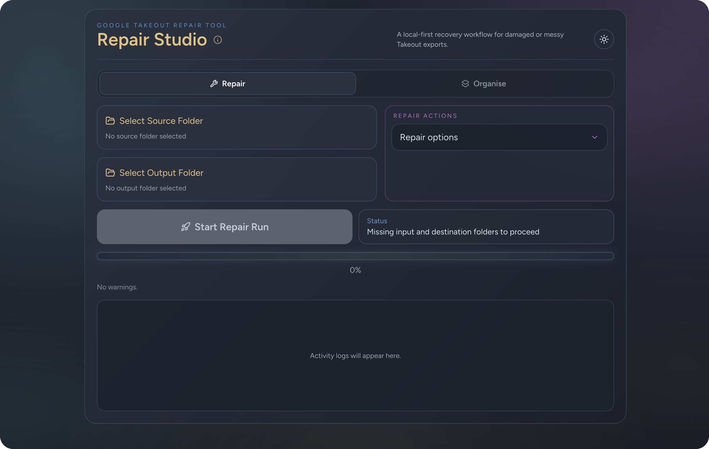

# Google Takeout Repair Tool

[](https://github.com/kogovsekm/google-takeout-repair-tool/releases)
[](https://github.com/kogovsekm/google-takeout-repair-tool/releases)
[](LICENSE)

Desktop utility for repairing and organizing Google Takeout photo and video exports.

Built as a local desktop tool to make Google Takeout cleanup easier, faster, and less frustrating.

It runs fully local on your machine using Electron.

If your Google Takeout export has missing photo dates, broken metadata, JSON sidecars, wrong folder structure, or media files that need reorganizing after export, this app is built for that exact workflow.

It helps restore metadata from Google Takeout sidecar JSON files, repair dates and descriptions where possible, and organize exports into cleaner year or year/month folders without uploading anything to the cloud.

> [!TIP]
> This tool is designed for people searching for ways to fix Google Takeout metadata, restore photo dates from sidecar JSON files, and reorganize exported media before importing it elsewhere.

## Endorsement

If you find this app valuable, consider giving it a star :star:.

## Why This Exists

Google Takeout exports often leave people with media libraries that are hard to import back into photo tools cleanly.

Common search terms this project is designed to solve:

- Google Takeout metadata missing
- restore photo dates from Google Takeout
- fix Google Takeout JSON sidecars
- organize Google Takeout photos by year and month
- repair EXIF metadata from Google Takeout exports

## Who This Is For

- People moving out of Google Photos and trying to preserve timestamps and metadata.
- Anyone with a Takeout archive full of sidecar JSON files and messy folders.
- Users who want a local desktop workflow instead of an online upload service.

## Common Google Takeout Problems This Fixes

- Photos and videos sorted into the wrong chronological order after export.
- Metadata trapped in Google Takeout sidecar JSON files instead of media files.
- Exports that need clean year or year/month folder structures before reimport.
- Already-exported folders that need flattening, cleanup, and safer reorganization.

## Before And After

Before:
Google Takeout media spread across nested export folders with separate JSON sidecars and inconsistent timestamps.

After:
Media copied or reorganized into cleaner folders with repaired metadata where available, safer names, and clearer import-ready structure.

## Feedback

If your Takeout export has an edge case this tool does not handle yet, open an issue in the repository and include a small reproducible example if possible.

# Installation

Download the release asset that matches your operating system from the GitHub Releases page.

- macOS Apple Silicon: use `Google Takeout Repair Tool-1.0.2-arm64.dmg`
- macOS Intel: use `Google Takeout Repair Tool-1.0.2.dmg`
- Windows 64-bit: use `Google Takeout Repair Tool Setup 1.0.2.exe`
- Linux 64-bit: use `Google Takeout Repair Tool-1.0.2.AppImage`

If you build the installers locally, open the `release` folder in the project root and choose the same file names listed above.

Checksums for the release artifacts are provided in `release/SHA256SUMS.txt` and can be used to verify downloads.

> [!IMPORTANT]
> Always verify that you downloaded the installer for the correct platform before opening it.


# Installation caveats

- macOS: because the app is currently distributed without Apple notarization, Gatekeeper may block the first launch. If that happens, open System Settings > Privacy & Security, scroll to the security section near the bottom, and allow the blocked app to run. Then launch it again.
- macOS: Apple Silicon users should prefer the `-arm64.dmg` build. The plain `.dmg` build is for Intel Macs and may require Rosetta on Apple Silicon.
- Windows: SmartScreen may warn that the app is from an unrecognized publisher because the installer is not code-signed with a trusted commercial certificate yet. If you trust the release, choose More info and then Run anyway.
- Linux: the AppImage may not start until it has executable permission. If needed, run `chmod +x "Google Takeout Repair Tool-1.0.2.AppImage"` and launch it again.
- Linux: some distributions need FUSE/AppImage support packages installed before AppImages will open.

## What It Does

This app has two tabs:

- Repair: restore metadata and copy media into a clean output structure.
- Organise: reorganize an already exported folder in place (post-processing).

## Core Features

- Local-first desktop app (no cloud upload).
- Repair workflow with separate source and output folders.
- Organise workflow for flattening folder levels.
- Real-time progress updates and live logs.
- Run reports with warnings and problem files.
- Light and dark themes.
- Tab lock while a job is active, with warning toast when switching tabs.

## Repair Tab Features

- Restore metadata from Google sidecar JSON files.
  - Writes date/time, title, description, and available GPS metadata.
  - Uses exact, fuzzy, and title-based sidecar matching to handle varied JSON naming patterns.
  - Applies confidence thresholds to fuzzy/title matches so low-confidence JSON files are skipped instead of linked incorrectly.
  - Mirrors compatible metadata to multiple tag families.
  - Syncs filesystem modified time from trusted sidecar timestamp when available.
  - Restores `.MOV` extension for QuickTime-branded files.
- Create year-month subfolders (YYYY/MM).
- Create year subfolders only (YYYY).
- Mutual exclusivity between folder modes:
  - Selecting year-only disables year-month.
  - Selecting year-month disables year-only.
- Duplicate-safe file naming using collision resolution.
- Inline path safety validation before each run (same folder / nested path protection).
- Non-empty output confirmation before processing.
- Hidden OS metadata files (for example `.DS_Store`, `Thumbs.db`) ignored for empty-folder checks.
- Sidecar cleanup summary after processing.

## Organise Tab Features

- Flatten months into years.
- Flatten years into root.
- Remove empty folders.
- Optional temporary review folder mode with explicit apply step.
- In-place moves with collision-safe destination names.
- Separate progress channel and dedicated organise report dialog.

## How To Run

### Prerequisites

- Node.js LTS
- npm

### Quick Start

```bash
# install dependencies
npm install

# start the desktop app in development mode
npm run dev

# create production bundles
npm run build

# run tests
npm run test
```

### Install

```bash
npm install
```

### Start Development App

```bash
npm run dev
```

### Build Production App

```bash
npm run build
```

### Run Tests

```bash
npm run test
```

## Packaging

Configured installer targets:

- macOS: DMG
- Windows: NSIS
- Linux: AppImage

Build installers for the current host:

```bash
npm run dist
```

Build all supported release installers, bump to a target version, and regenerate checksums in one command:

```bash
npm run release:all -- 1.0.2
```

When running `release:all`, the version argument is used to update the version in `package.json`, which is then used by `electron-builder` to set the version in the generated installers. Please check the latest version on the Github Releases page and bump accordingly.

Output folder:

```text
release/
```

## Scripts

```bash
npm run dev        # run renderer and Electron in development mode
npm run build      # build renderer and Electron bundles
npm run dist       # package installers via electron-builder
npm run release:all -- 1.0.2  # bump version, build macOS+Windows+Linux installers, regenerate SHA256SUMS
npm run test       # run unit/integration tests with Vitest
npm run lint       # run ESLint
npm run benchmark  # run synthetic processing benchmark
```

## Project Structure

```text
electron/main.ts                         app lifecycle and IPC handlers
electron/preload.ts                     secure renderer bridge
electron/processor.ts                   repair and post-process logic
src/App.tsx                             primary renderer UI (tabs, actions, progress, logs)
src/components/ProcessReportDialog.tsx  repair report dialog
src/components/OrganiseReportDialog.tsx organise report dialog
src/types/electronApi.ts                shared renderer-side API types
```

## Safety Notes

- Repair writes into a destination folder you choose.
- Organise works in place on the selected folder.
- Keep a backup of original Takeout exports before large runs.

## License

This project is licensed under the MIT License. See [LICENSE](LICENSE).
